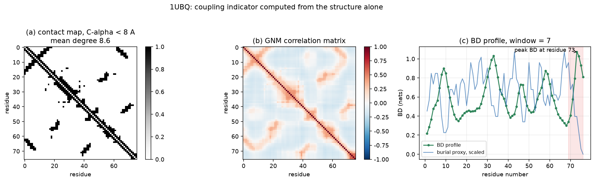
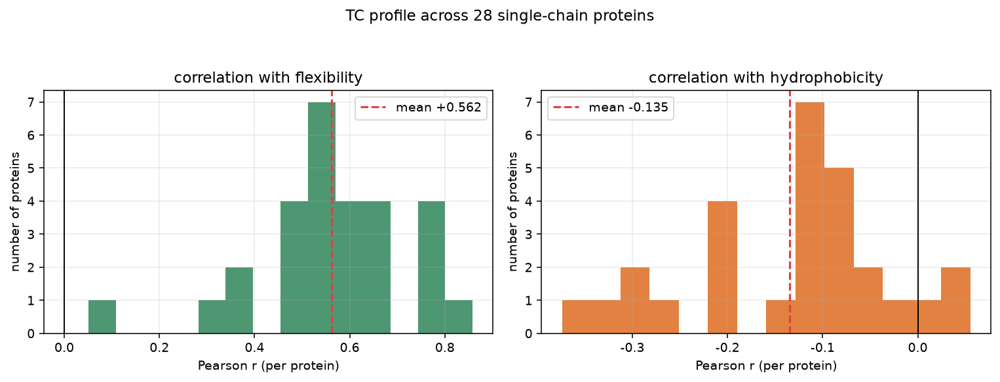
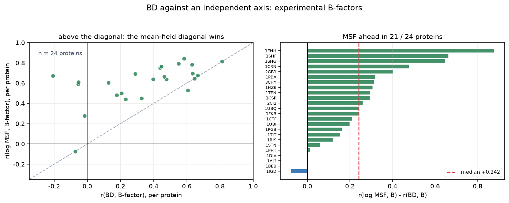

# GNM Block Dependence Profile

> The repository name `tc-coupling-profile` is historical and is kept so that existing links
> keep working. The method is called **BD** (block dependence); see *Naming and prior art*
> at the end for why the earlier name was dropped.

**Mean field is almost always good enough. This tells you where "almost" fails.**

Independence is the default assumption when modelling the flexibility of a
protein: each residue is treated as moving on its own. That assumption is
cheap, and almost everywhere it is fine. But "almost everywhere" is not
"everywhere", and the places where it breaks down are not random.

This repository computes a single number per residue -- **BD**, the block total
correlation -- measuring how much is lost by assuming that the residues in a
local window move independently:

```
BD(B) = KL( N(0, R_BB) || N(0, diag(R_BB)) ) = -1/2 * ln det R_BB
```

Large BD means the residues in that window are strongly coupled and an
independent description of them is a poor one. Small BD means independence is
a good description.

The input is a PDB file. There is no simulation, no training, no experimental
data and no fitting.

## What it is for

It is a **prior on where to look**, not an answer. If effort is going to be
spent modelling local flexibility -- a normal-mode calculation, a covariance
estimate, a simulation at coarse-grained resolution -- BD says which windows
are the ones where the independent-motion assumption costs the most, and gives
that ranking in under a second from the structure alone.

## Use it

```bash
pip install -r requirements.txt

python experiments/plot_profile.py          # profile for one structure
python experiments/run_multiprotein.py      # validation over 28 proteins
python experiments/check_ligand_sites.py    # does it point at binding sites?
python experiments/bfactor_validation.py    # independent check against B-factors
python experiments/stage0_audit.py          # axis orthogonality, conditioning, LOPO
python experiments/plot_bfactor_validation.py   # figure 3
```

```python
from src.bd_profile import profile_from_pdb

profile, corr, names = profile_from_pdb("1UBQ", window=7)
```

`profile[i]` is the BD of a 7-residue window centred on residue `i+1`.

## What it looks like



For ubiquitin the largest value sits at the C-terminal tail (residues 70-76),
the segment that is known to be flexible. Below it, the burial proxy for the
same residues on a comparable scale.

## What it correlates with

28 single-chain proteins, 40-160 residues, diverse folds, window 7. Each
protein is correlated independently. Pearson `r` is a skewed statistic, so both
the naive arithmetic mean and the Fisher-z mean (`mean of artanh(r)`,
back-transformed) are given.

| property | arithmetic mean r | Fisher-z mean r | same sign |
| --- | --- | --- | --- |
| flexibility (GNM mean-square fluctuation) | +0.562 | **+0.583** | 28 / 28 positive |
| contact degree | -0.405 | -0.417 | 27 / 28 negative |
| burial (C-alpha coordination number) | -0.469 | -0.484 | 27 / 28 negative |
| hydrophobicity (Kyte-Doolittle) | -0.135 | — | 25 / 28 negative |

> **The flexibility row is not independent evidence.** That quantity is the GNM's
> own mean-square fluctuation -- the diagonal of the same pseudo-inverse that BD
> is built from. BD and it are two functionals of one matrix, so agreement is
> close to guaranteed, and no amount of partial correlation fixes that.
> The independent test is against experimental B-factors, further down.



The sign pattern is the interesting part, and it is mildly counter-intuitive:

> **BD is highest where the protein is soft and exposed, not where it is
> densely packed.**

A flexible segment swings as a unit, so the motions of its residues are almost
perfectly correlated with each other. A residue in a tightly packed core is
held by many neighbours at once, barely moves, and correlates less with its
immediate neighbours. Contact density increases the *number* of constraints
without increasing the *correlation* between neighbouring displacements, which
is why the contact-degree row is negative.

The hydrophobicity row has the sign one might expect from the intuition that
polar surfaces couple more strongly, but the effect is weak and largely
explained by burial; do not lean on it.

## Is BD just contact density in disguise?

This is the sharpest objection the indicator faces, and it deserves a direct
answer. BD and contact degree are both functions of the same contact graph, so
a correlation between them is guaranteed and proves nothing. The question is
whether BD carries information that contact degree does not.

Test: z-score BD, contact degree and flexibility within each protein, pool the
2412 residues from the 28 structures, and compute the partial correlation of
BD with flexibility while controlling for contact degree.

| quantity | value |
| --- | --- |
| r(BD, flexibility) | +0.581 |
| r(BD, contact degree) | -0.391 |
| r(flexibility, contact degree) | -0.809 |
| **partial r(BD, flexibility \| contact degree)** | **+0.490** |

Contact density explains most of the flexibility signal (-0.81), but BD retains
a large, clearly non-zero association on top of it (`z/SE ≈ 26` at n = 2412).
Per protein, the partial correlation is positive in 27 of 28 structures
(mean +0.461). **BD is not a repackaging of contact density.**

> **Caveat added later.** Both columns of that table come from the elastic
> network: the "flexibility" here is the GNM mean-square fluctuation, so this
> test asks whether one functional of the Kirchhoff matrix predicts another.
> It is a useful sanity check but it cannot establish that BD tracks real
> motion. `z/SE ≈ 26` also overstates the evidence, because residues within a
> protein are not independent samples -- the per-protein sign test (27 of 28)
> is the defensible part. The independent test is the B-factor section below.

## Independent check: experimental B-factors

B-factors are experimental. They ship with the PDB file and owe nothing to the
elastic network, a force field or a simulation. They are a weaker proxy than a
trajectory -- crystal packing, resolution and refinement all leak into them --
but they are *independent*, which is the property that was missing.

`experiments/bfactor_validation.py`. Every structure in `data/pdb` with a usable
C-alpha B-factor: 30 were tried, 6 dropped because their B-factors are uniform
(predicted models or fixed-B refinement), leaving 24 proteins and 2,021 residues.

*Pooled (within-protein)* means z-scoring each quantity inside its own protein
before concatenating residues, so between-protein variation stays out of the
correlation. *Pooled (raw residues)* is the naive concatenation. The two
conventions disagree in sign of which indicator wins, and that disagreement is
between-protein variation, not biology -- see the audit section below.

| quantity | per-protein median | positive | pooled (within-protein) | pooled (raw residues) |
| --- | --- | --- | --- | --- |
| r(BD, B-factor) | +0.418 | 19 / 24 | +0.376 | +0.644 |
| r(log MSF, B-factor) | +0.641 | 23 / 24 | +0.589 | +0.480 |
| r(contact degree, B-factor) | -0.540 | 1 / 24 | -0.459 | -0.139 |
| partial r(BD, B-factor \| contact degree) | +0.236 | 16 / 24 | +0.253 | +0.637 |

The mean-field column is the one that matters for the verdict: the diagonal of the
same matrix predicts B-factors better than BD does, within protein and after
removing between-protein variation.



How to read it, honestly:

* **BD does carry real signal**: the association with an experimental quantity
  is positive in 19 of 24 proteins.
* **It is not the strongest signal**: contact density alone tracks B-factors
  more closely (negative in 23 of 24).
* **Once contact density is controlled for, only a modest association
  survives** (+0.25 with between-protein variation removed, +0.64 without) --
  real, but much smaller than the +0.49 that the same-matrix analysis suggested.
* **The effect is heterogeneous**: per-protein r(BD, B) spans -0.21 to +0.81.
  A single pooled number would hide that, so both are reported.

The honest summary of this indicator: it tracks an experimental flexibility
proxy, weakly and not everywhere, and it does not replace contact density.

## What it is **not**

**It does not identify binding sites or active pockets.** We tested this
directly, because it is the natural thing to hope for: take structures with a
bound ligand, find the residues within 5 A of the ligand, and compare their BD
against the chain average. The result is the opposite of the hope.

| structure | ligand-site residues | site BD | chain mean BD | z |
| --- | --- | --- | --- | --- |
| 3PTB (trypsin) | 8 | 0.301 | 0.527 | -0.73 |
| 4DFR (DHFR) | 8 | 0.473 | 0.640 | -0.68 |
| 1STP (streptavidin) | 5 | 0.546 | 0.578 | -0.08 |
| 3ERT (oestrogen receptor) | 8 | 0.883 | 1.001 | -0.28 |
| 1M17 (EGFR kinase) | 14 | 0.856 | 1.248 | -0.34 |

Mean z = -0.42, and 0 of 5 structures show enrichment. Ligand-binding sites sit
at *lower* BD than the chain average, consistent with the main result: binding
sites tend to be the rigid part of a protein, while BD marks the soft part. So
BD is, if anything, mildly **anti**-correlated with binding sites. The honest
statement of the use case is "where independence costs the most", not "where
the active site is".

This test uses a small set and only five structures produced usable ligand
geometry, so treat it as a caution rather than a result. It is included because
a negative check is more useful than an unexamined claim.

Other caveats:

* the underlying model is the GNM, a single-parameter elastic network. It
  captures contact topology and nothing else -- no side chains, no chemistry,
  no solvent, no sequence conservation;
* the validation set is 28 small single-chain proteins; nothing here says the
  numbers transfer to large multi-domain proteins or complexes;
* window length is a free parameter. 7 is a reasonable default, but BD grows
  with window size, so profiles are comparable in *shape* across window
  lengths, not in magnitude;
* zero hits in the literature scan in `docs/NOTES.md` are not evidence of
  novelty, only that a phrase search did not find them;
* **BD is not a reason to discard a pocket.** A region that is both mobile and strongly
  coupled (high amplitude, high BD) may be an induced-fit or cryptic site. That is a
  *routing* signal toward ensemble methods, not a rejection.

## Files

```
src/bd_profile.py            the indicator: GNM covariance and block BD
src/pdb_io.py                minimal dependency-free PDB reader
experiments/plot_profile.py  contact map, GNM correlation, BD profile
experiments/run_multiprotein.py     the 28-protein validation
experiments/check_ligand_sites.py   the binding-site check above
experiments/bfactor_validation.py   independent check against experimental B-factors
experiments/plot_bfactor_validation.py   figure for the B-factor check
experiments/stage0_audit.py  axis orthogonality, conditioning, cutoff/window, LOPO
results/                     CSV output
results/stage0_key_numbers.csv   every number quoted in the audit section
figures/                     figures used above
docs/NOTES.md                derivation, worked example, literature scan
```

## Note

A separate piece of work uses this indicator to decide where a non-diagonal
covariance block should be placed in a variational model of conformational
ensembles. That is not part of this repository.

## Naming and prior art

The quantity computed here is the **block total correlation** of the GNM correlation matrix,
written `BD(B) = -1/2 ln det R_BB`. Two naming points, both of which matter for how this work
should be read:

* **Total correlation** is Watanabe's 1960 information-theoretic quantity. This repository does
  not claim it. What is proposed is a specific *block-level* use of it on the GNM correlation
  matrix, as a per-residue profile.
* Work published in **2011** already applies a GNM-derived quantity *also called* "total
  correlation" to ligand-binding sites and interaction pathways. Its definition is not the same
  as `-1/2 ln det R_BB`, but the phrase collision is real, and it means that
  **"GNM + total correlation + binding site" cannot be presented as an untouched area**. The
  method is therefore named **BD (block dependence)**, so that what is being discussed is
  unambiguous: the block-level dependence of the GNM correlation matrix.

## Audit against an independent experimental axis (2026-09-20)

The indicator was audited against crystallographic B-factors -- an axis that is
independent of the elastic network model. 30 structures; 6 excluded because their
B-factors are uniform (predicted models or fixed-B refinement), leaving 24 proteins
(2,021 residues).

| quantity | within-protein median r | positive | pooled r (raw residues) |
| --- | --- | --- | --- |
| BD vs B-factor | +0.418 | 19 / 24 | +0.644 |
| **GNM mean-square fluctuation vs B-factor** | **+0.641** | **23 / 24** | +0.480 |
| contact degree vs B-factor | -0.540 | 1 / 24 | -0.139 |
| partial: BD vs B-factor given contact degree | +0.236 | 16 / 24 | +0.637 |

**Within protein, the GNM mean-square fluctuation -- the trivial diagonal of the same
matrix -- predicts B-factors better than BD does (median r = +0.64 vs +0.42). BD therefore
adds no information beyond the diagonal.**

The two quantities the framework wanted to separate are **not orthogonal**: pooled
r(log MSF, BD) = **+0.684** across all residues, and **+0.632** once each quantity is
z-scored inside its own protein first. Both conventions put the two axes on top of each
other, so the proposed "2x2 dynamic map" (amplitude x coupling) cannot be built on this
dataset.

Pooled across raw residues BD appears stronger than MSF (+0.64 vs +0.48), but the moment
each quantity is z-scored within its own protein the ordering flips (+0.38 vs +0.59). The
first number is an artefact of pooling between-protein variation, not a within-protein
effect -- **the same Simpson-type trap this project originally set out to audit**.

Two further robustness checks, reported rather than hidden: the pooled BD/MSF correlation
falls from +0.68 (8 A cutoff) to +0.45 (12 A) and from +0.71 (window 5) to +0.57 (window 15)
-- both measured on raw pooled residues; numeric conditioning is benign (median smallest
eigenvalue 0.58, median condition number 4.2, median effective rank 5.9 of a 7-residue
window, so the near-singularity concern raised in review does not apply at 8 A). Leaving one
structure out at a time moves the within-protein correlation only between +0.62 and +0.64,
so no single protein carries the result.

**Conclusion.** Block dependence as formulated here is a repackaging, not an increment: the
mean-field diagonal of the GNM already carries essentially all of the information that this
independent experimental axis can detect. The audit is the result.

## Attribution and AI assistance

Every mathematical ingredient used here is published work and is cited in
[`docs/NOTES.md`](docs/NOTES.md): the Gaussian Network Model, total
correlation, the modified Cholesky decomposition and the Kyte-Doolittle scale.
What this repository claims is only the specific formulation and its
validation, not the underlying methods -- and a phrase search is not a
systematic review, so please read the prior-art note before treating anything
here as new.

The code was written with AI coding assistance under the author's direction.
The research question, the design decisions and the interpretation of results
are the author's, and the author is responsible for their correctness.
