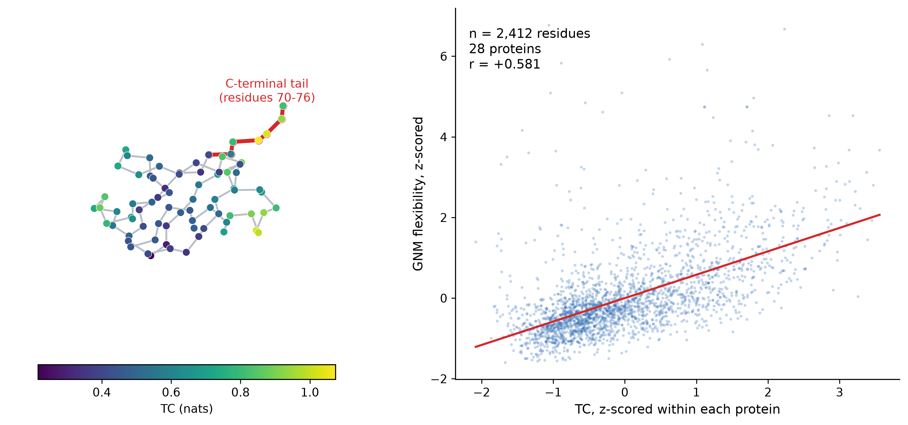

# tc-coupling-profile

**A structure-only dynamics filter for triaging surface pockets before you spend GPU time on them.**

[](https://huggingface.co/spaces/recklesswater/tc-coupling-profile)
[](https://www.python.org/)
[](https://github.com/recklesswater/tc-coupling-profile)
[](LICENSE)

One PDB file in, one number per residue out, in under a second. No simulation, no
training set, no experimental data, no fitting.



**Left:** ubiquitin (1UBQ), C-alpha trace coloured by TC, with the high-TC C-terminal tail
(residues 70-76) highlighted. **Right:** TC against GNM flexibility, both z-scored within each
protein and pooled over 28 single-chain proteins (2412 residues, r = +0.581; the per-protein
mean is r = +0.563, positive in 28 of 28). TC is highest exactly where the chain is soft and
exposed, and lowest where the fold is rigid.

---

## What it computes

TC is the **block total correlation** of a local window in the Gaussian Network Model
correlation matrix:

```
TC(B) = KL( N(0, R_BB) || N(0, diag(R_BB)) ) = -1/2 * ln det R_BB
```

Large TC means the residues in that window move as a unit, and an independent (diagonal)
description of their motion is a poor approximation. Small TC means independence is a good
description. Everything is derived from the C-alpha trace alone.

## Application in AIDD: a Druggability Filter

Pocket detection in industrial pipelines is dominated by local geometry: cavity volume,
SASA, depth, hydrophobicity. Those descriptors are cheap and they work, but they share a
blind spot. A long, highly flexible loop can present a geometrically perfect cavity while
carrying almost no conformational stability. Docking into it yields poses that are
energetically plausible on paper and meaningless in practice, and every one of those poses
costs downstream screening time.

**The useful role of TC here is not to find pockets. It is to disqualify the ones that will
not hold a ligand.** TC supplies a global dynamical term that geometric descriptors do not
have, and it does so without a molecular dynamics run.

| surface signature | interpretation | action |
| --- | --- | --- |
| high SASA + **high TC** | large but soft: high local correlation, a flexible loop or loosely tethered segment | deprioritise; docking scores here are not trustworthy |
| high SASA + **low TC** | solvent-exposed but conformationally rigid, with a coupled core behind it | prioritise; this is the geometry that can actually support a binding event |
| low SASA + low TC | buried and rigid | standard buried-site handling |

The reasoning is a direct consequence of the validated statistics below. TC is positively
correlated with flexibility (mean r = +0.563) and negatively correlated with burial
(mean r = -0.469). A large surface patch that also carries high TC is therefore, by
measurement, a soft patch. Pairing an existing geometric pocket score with TC turns two
independently computed signals into a single triage rule:

```python
from src.tc_profile import profile_from_pdb

profile, corr, names = profile_from_pdb("1UBQ", window=7)

# pocket residues from your existing geometric detector
pocket_tc = profile[[i - 1 for i in pocket_residues]]

if pocket_tc.mean() > protein_mean + 0.5 * protein_sd:
    verdict = "soft patch - deprioritise"
else:
    verdict = "rigid patch - keep for docking"
```

This is a proposed screening criterion, stated as such: it follows from the measured
correlations, but the enrichment of true binding sites among "high SASA + low TC" patches
has not yet been benchmarked on a curated holo set. The honest claim is that TC adds an
orthogonal dynamical axis to an existing funnel at effectively zero cost — not that it
replaces pocket detection. The benchmark that would settle it is specified in
[`docs/AIDD_VALIDATION_PLAN.md`](docs/AIDD_VALIDATION_PLAN.md): pocket-level enrichment on
COACH420 with a geometry-only model as the baseline, grouped cross-validation by protein, and
a pre-registered interpretation for each possible outcome.

## Validation in one table

28 single-chain proteins, 40-160 residues, diverse folds, window 7. Each protein is
correlated independently; Pearson r is a skewed statistic, so the Fisher-z mean
(`mean of artanh(r)`, back-transformed) is reported alongside the arithmetic mean.

| property | arithmetic mean r | Fisher-z mean r | consistency |
| --- | --- | --- | --- |
| flexibility (GNM mean-square fluctuation) | +0.562 | **+0.583** | 28 / 28 positive |
| contact degree | -0.405 | -0.417 | 27 / 28 negative |
| burial (C-alpha coordination number) | -0.469 | -0.484 | 27 / 28 negative |
| hydrophobicity (Kyte-Doolittle) | -0.135 | — | 25 / 28 negative |


The sign pattern is the substance of the indicator, and it runs against the usual
intuition: **TC is highest where the protein is soft and exposed, not where it is densely
packed.** A flexible segment swings as a unit, so its residues are almost perfectly
correlated with one another. A residue in a tightly packed core is held from many sides at
once, barely moves, and correlates less with its immediate neighbours. Contact density adds
constraints; it does not add correlation between neighbouring displacements.

## "Isn't TC just contact density wearing a different hat?"

This is the first question a reviewer or an interviewer asks, and it has a quantitative
answer.

TC and contact degree are both functions of the same contact graph, so some correlation
between them is guaranteed and proves nothing on its own. The question is whether TC
carries information that contact degree does not.

Measured over 28 proteins, the correlation between the two is **r = -0.406**, which means
contact degree explains about **16% of the variance in TC**. They are not the same
quantity. In the pooled residue-level analysis (z-scored within each protein, 2412 residues,
28 structures):

| quantity | value |
| --- | --- |
| r(TC, flexibility) | +0.581 |
| r(TC, contact degree) | -0.391 |
| r(flexibility, contact degree) | -0.809 |
| **partial r(TC, flexibility \| contact degree)** | **+0.490** |

Contact density absorbs most of the flexibility signal (-0.81), yet TC retains a large and
clearly non-zero association on top of it (`z/SE ≈ 26` at n = 2412), and the per-protein
partial correlation is positive in 27 of 28 structures.

The physical reason is a difference in kind, not degree. Contact density is a **local,
static geometric count**: it asks how many neighbours sit within a cutoff. TC is computed
from the **pseudoinverse of the Kirchhoff matrix**, and matrix inversion is a global
operation — every entry of the result depends on the whole contact graph, not just on the
local neighbourhood. TC therefore carries long-range, allosteric coupling information that
a neighbour count cannot represent. **TC is not a repackaging of contact density.**

## What it is not

**It does not identify binding sites or active pockets.** This was tested directly, because
it is the natural thing to hope for. Taking holo structures and comparing the TC of
residues within 5 Å of the ligand against the chain average:

| structure | ligand-site residues | site TC | chain mean TC | z |
| --- | --- | --- | --- | --- |
| 3PTB (trypsin) | 8 | 0.301 | 0.527 | -0.73 |
| 4DFR (DHFR) | 8 | 0.473 | 0.640 | -0.68 |
| 1STP (streptavidin) | 5 | 0.546 | 0.578 | -0.08 |
| 3ERT (oestrogen receptor) | 8 | 0.883 | 1.001 | -0.28 |
| 1M17 (EGFR kinase) | 14 | 0.856 | 1.248 | -0.34 |

Mean z = -0.42, and none of the five structures shows enrichment. Binding sites sit at
*lower* TC than the chain average, which is consistent with the main result rather than in
tension with it. That is precisely what makes the druggability-filter application above
possible: the signal is informative about pocket *quality*, not pocket *location*.

Further caveats:

* the underlying model is the GNM, a single-parameter elastic network. It captures contact
  topology and nothing else — no side chains, no chemistry, no solvent, no conservation;
* the validation set is 28 small single-chain proteins. Nothing here demonstrates transfer
  to large multi-domain proteins or complexes;
* window length is a free parameter. 7 is a reasonable default; TC grows with window size,
  so profiles are comparable in *shape* across window lengths, not in magnitude;
* the ligand-site test used five structures with usable ligand geometry. Treat it as a
  caution, not as a benchmark;
* zero hits in the literature scan in `docs/NOTES.md` are not evidence of novelty, only that
  a phrase search did not find them.

## Quick start

```bash
pip install -r requirements.txt

python experiments/plot_profile.py          # profile for one structure
python experiments/run_multiprotein.py      # validation over 28 proteins
python experiments/check_ligand_sites.py    # does it point at binding sites?
```

```python
from src.tc_profile import profile_from_pdb

profile, corr, names = profile_from_pdb("1UBQ", window=7)
```

`profile[i]` is the TC of a 7-residue window centred on residue `i+1`. Typical runtime is
under a second per structure on a laptop CPU.

## Repository layout

```
src/tc_profile.py                    the indicator: GNM covariance and block TC
src/pdb_io.py                        minimal dependency-free PDB reader
experiments/plot_profile.py          contact map, GNM correlation, TC profile
experiments/run_multiprotein.py      the 28-protein validation
experiments/check_ligand_sites.py    the binding-site check
experiments/partial_correlation.py   the contact-density defence above
experiments/make_hero_image.py       builds figures/fig0_hero.png
results/                             CSV output
figures/                             figures used above
space/                               Gradio demo (Hugging Face Space)
docs/NOTES.md                        derivation, worked example, literature scan
docs/AIDD_VALIDATION_PLAN.md         benchmark design for the druggability filter
```

## Attribution and AI assistance

Every mathematical ingredient used here is published work and is cited in
[`docs/NOTES.md`](docs/NOTES.md): the Gaussian Network Model, total correlation, the
modified Cholesky decomposition and the Kyte-Doolittle scale. What this repository claims is
the specific formulation and its validation, not the underlying methods — and a phrase
search is not a systematic review, so please read the prior-art note before treating
anything here as new.

The code was written with AI coding assistance under the author's direction. The research
question, the design decisions and the interpretation of results are the author's, and the
author is responsible for their correctness.

## Note

A separate piece of work uses this indicator to decide where a non-diagonal covariance block
should be placed in a variational model of conformational ensembles. That is not part of this
repository.
